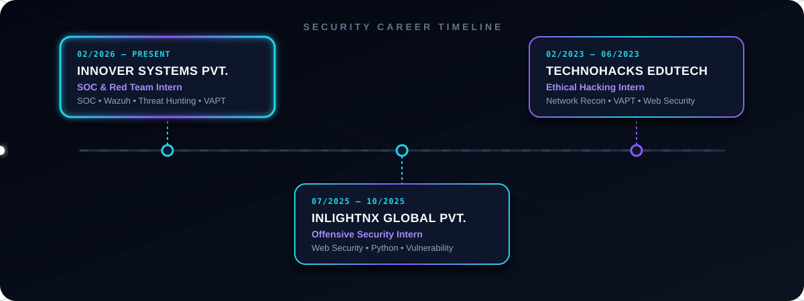
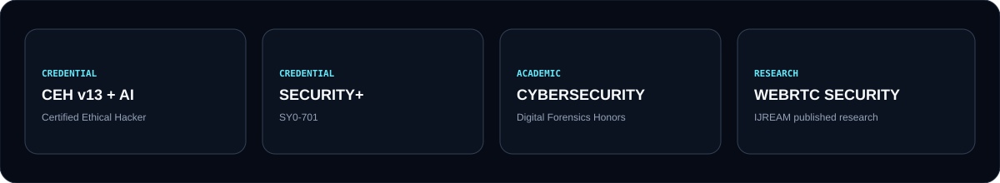
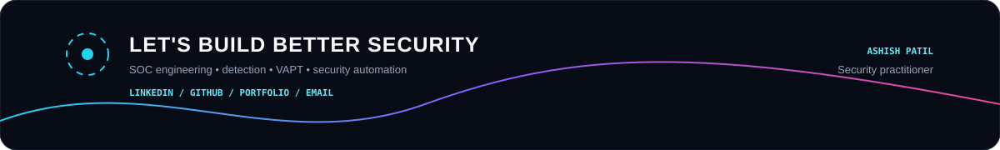

 

 

## Security Profile

> **Cybersecurity Analyst focused on connecting offensive security with defensive engineering — from finding weaknesses to building the visibility and detections needed to understand them.**

My current focus spans **SOC operations, Wazuh SIEM/XDR, detection engineering, threat hunting, endpoint telemetry, firewall monitoring and web application VAPT**. I also use Python, PowerShell and Bash to reduce repetitive security work and turn operational requirements into reusable tooling.

## Capability Matrix

## Selected Work

<table width="100%" cellspacing="12">
<tr>
<td width="50%" valign="top">

### 🛡️ SOC & Detection Engineering

`WAZUH` `SIEM/XDR` `SYSMON`

**Build visibility. Improve detection.**

- Custom Wazuh decoders and rules
- Endpoint and Sysmon telemetry
- Sophos firewall / syslog ingestion
- Detection dashboards and alert tuning
- Threat-hunting and investigation workflows

</td>
<td width="50%" valign="top">

### ⚔️ Web Application VAPT

`OWASP` `BURP SUITE` `RECON`

**Validate the attack surface.**

- OWASP Top 10 assessment
- SQL injection, XSS and IDOR testing
- Authentication and authorization testing
- Attack-surface discovery
- Vulnerability validation and reporting

</td>
</tr>
<tr>
<td width="50%" valign="top">

### ⚙️ Security Automation

`PYTHON` `POWERSHELL` `BASH`

**Automate the repetitive.**

- Security-focused scripting
- Log processing and transformation
- Reporting workflows
- Operational security tooling

</td>
<td width="50%" valign="top">

### ☁️ Security Infrastructure

`AWS` `EC2` `LINUX`

**Operate the security platform.**

- SIEM infrastructure operations
- Security telemetry pipelines
- Linux monitoring services
- Log ingestion and troubleshooting

</td>
</tr>
</table>

## Experience

### Cybersecurity Analyst / Purple Team — Innover Systems Pvt. Ltd.
`Feb 2026 – Present`

`SOC` `WAZUH` `SIEM/XDR` `VAPT` `DETECTION ENGINEERING` `THREAT HUNTING`

Building practical SOC capabilities around endpoint and network telemetry, custom Wazuh detection logic, dashboards, firewall monitoring, threat investigation and vulnerability-assessment workflows.

### Offensive Security Intern — InLighnX Global Pvt. Ltd.
`Jul 2025 – Oct 2025`

`WEB SECURITY` `VAPT` `PYTHON`

Performed web application security testing, vulnerability validation and Python-based security automation.

### Ethical Hacking Intern — TechnoHacks EduTech
`Feb 2023 – Jun 2023`

`RECON` `NETWORK SECURITY` `WEB SECURITY`

Worked on network reconnaissance, scanning and practical web-security testing.

 

## Security Arsenal

  

 

 

## Credentials & Research

- **Certified Ethical Hacker (CEH) v13 with AI**
- **CompTIA Security+ — SY0-701**
- **Cybersecurity & Digital Forensics Honors**
- **IJREAM published research — WebRTC Security Analysis**

 

  

</a>
&nbsp;

  

 

  

## Contact

  

  

Built around security engineering, practical visibility and continuous improvement.

