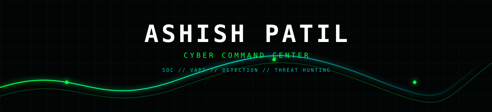
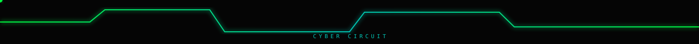
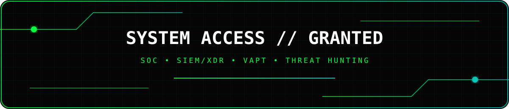
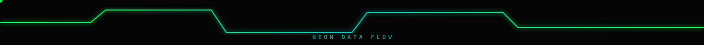
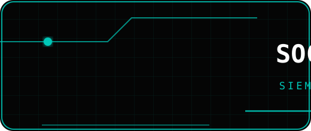
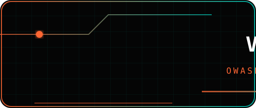
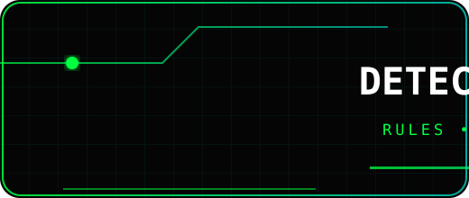
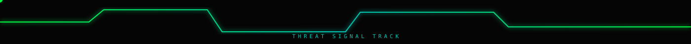

<div align="center">



<br>


<br>

<a href="https://linkedin.com/in/ashishpatil7507"></a>
<a href="mailto:ashishpatil.cyber@gmail.com"></a>
<a href="https://github.com/ashishpatil7507"></a>
<a href="https://ashish-patil.gamer.gd"></a>

<br><br>


</div>

---

<div align="center">

</div>

## ◈ SYSTEM ACCESS

<div align="center">

</div>

<br>

<div align="center">

</div>

---

<div align="center">

</div>

## ⚔ SECURITY MATRIX

<div align="center">
<table>
<tr>
<td width="25%" align="center">

</td>
<td width="25%" align="center">

</td>
<td width="25%" align="center">

</td>
<td width="25%" align="center">

</td>
</tr>
</table>
</div>

---

<div align="center">

</div>

## 🧰 SECURITY ARSENAL

<div align="center">


<br>


<br>


</div>

---

<div align="center">

</div>

## 🧪 SELECTED OPERATIONS

<div align="center">
<table>
<tr>
<td width="50%" valign="top">

### 🛡 Wazuh SOC Engineering

`SIEM/XDR` `Detection` `Sysmon`

- Custom rules and decoders
- Endpoint telemetry
- Firewall/syslog monitoring
- Security dashboards
- Alert tuning
- Threat hunting

</td>
<td width="50%" valign="top">

### ⚔ Web VAPT

`OWASP` `Burp Suite` `Recon`

- SQL Injection
- XSS
- IDOR
- Authentication testing
- Attack-surface discovery
- Vulnerability validation

</td>
</tr>
<tr>
<td width="50%" valign="top">

### ⚙ Security Automation

`Python` `PowerShell` `Bash`

- Log processing
- Security scripting
- Reporting automation
- Operational tooling

</td>
<td width="50%" valign="top">

### ☁ Cloud Security

`AWS` `EC2` `Linux`

- SOC infrastructure
- Security monitoring
- Log pipelines
- Infrastructure operations

</td>
</tr>
</table>
</div>

---

<div align="center">

</div>

## 💼 EXPERIENCE

**Cybersecurity Analyst / Purple Team — Innover Systems Pvt. Ltd.**  
`Feb 2026 – Present`

`SOC` `Wazuh` `SIEM/XDR` `VAPT` `Detection Engineering` `Threat Hunting`

- Building practical SOC monitoring capabilities using Wazuh.
- Developing custom rules, decoders and security dashboards.
- Monitoring endpoint, Sysmon and firewall telemetry.
- Performing vulnerability assessment and web application security testing.
- Investigating suspicious authentication, process and network activity.

**Offensive Security Intern — InLighnX Global Pvt. Ltd.**  
`Jul 2025 – Oct 2025`

- Web application security testing and vulnerability validation.
- Python-based security automation.
- Practical offensive-security methodology and reporting.

**Ethical Hacking Intern — TechnoHacks EduTech**  
`Feb 2023 – Jun 2023`

- Network reconnaissance and scanning.
- Web application security testing.
- Practical ethical-hacking and SOC workflows.

---

<div align="center">

</div>

## 🏆 CREDENTIALS

<div align="center">


<br><br>

`Certified Ethical Hacker (CEH) v13 with AI`  
`CompTIA Security+ — SY0-701`  
`Cybersecurity & Digital Forensics Honors`  
`IJREAM Published Research — WebRTC Security Analysis`

</div>

---

<div align="center">

</div>

## 📊 GITHUB TELEMETRY

<div align="center">

<a href="https://github.com/ashishpatil7507">

</a>

<a href="https://github.com/ashishpatil7507">

</a>

<br><br>


</div>

---

<div align="center">

</div>

## 🧠 SECURITY MINDSET

<div align="center">

```text
THINK LIKE AN ATTACKER
          ↓
UNDERSTAND THE ATTACK
          ↓
COLLECT THE TELEMETRY
          ↓
BUILD THE DETECTION
          ↓
INVESTIGATE THE SIGNAL
          ↓
IMPROVE THE CONTROL
```

### `OFFENSE → VISIBILITY → DETECTION → RESPONSE → HARDENING`

</div>

---

<div align="center">

## 📡 CONTACT // CHANNEL OPEN

<a href="https://linkedin.com/in/ashishpatil7507"></a>
<a href="mailto:ashishpatil.cyber@gmail.com"></a>
<a href="https://ashish-patil.gamer.gd"></a>

<br><br>

`[ SYSTEM STATUS: ONLINE ]`  
`[ SECURITY TELEMETRY: ACTIVE ]`  
`[ THREAT SURFACE: MONITORED ]`

</div>


