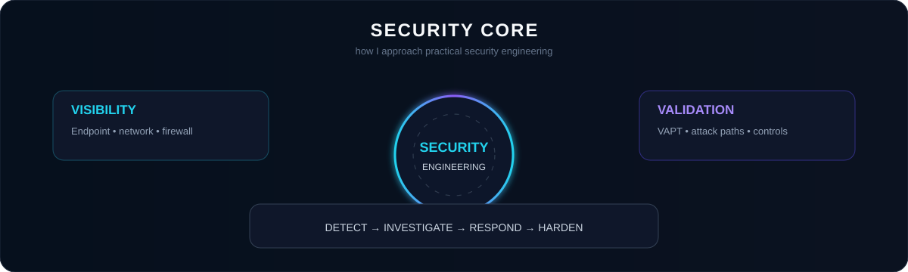
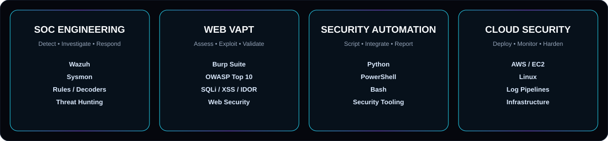

 

  

  

---

## About

**Cybersecurity Analyst focused on SOC operations, VAPT, detection engineering and security automation.**

I work across both sides of the security lifecycle: identifying weaknesses through offensive testing and turning telemetry into practical detections, investigations and security improvements.

---

## Security Focus

---

## Technology Stack

**SOC / Detection**

 

**Offensive Security**

 

**Automation / Infrastructure**

---

## Selected Work

### 🛡️ Wazuh SOC Engineering
`SIEM/XDR` `Detection Engineering` `Sysmon`

- Custom Wazuh rules and decoders
- Endpoint and Sysmon telemetry
- Firewall / syslog monitoring
- Security dashboards and alert tuning
- Threat-hunting workflows

### ⚔️ Web Application VAPT
`OWASP` `Burp Suite` `Recon`

- OWASP Top 10 testing
- SQL Injection, XSS and IDOR assessment
- Authentication and authorization testing
- Attack-surface discovery and validation

### ⚙️ Security Automation
`Python` `PowerShell` `Bash`

- Security scripting
- Log processing
- Reporting automation
- Operational security tooling

---

## Experience

**Cybersecurity Analyst / Purple Team — Innover Systems Pvt. Ltd.**  
`Feb 2026 – Present`

`SOC` `Wazuh` `SIEM/XDR` `VAPT` `Detection Engineering` `Threat Hunting`

Building practical SOC monitoring capabilities, custom detection logic, security dashboards, endpoint telemetry workflows and vulnerability-assessment processes.

**Offensive Security Intern — InLighnX Global Pvt. Ltd.**  
`Jul 2025 – Oct 2025`

`Web Security` `Python Automation` `VAPT`

Web application security testing, vulnerability validation and Python-based security automation.

**Ethical Hacking Intern — TechnoHacks EduTech**  
`Feb 2023 – Jun 2023`

`Recon` `Network Security` `Web Security`

Network reconnaissance, scanning and practical web-security testing.

---

## Credentials & Research

  

`Certified Ethical Hacker (CEH) v13 with AI`  
`CompTIA Security+ — SY0-701`  
`Cybersecurity & Digital Forensics Honors`  
`IJREAM Research Publication — WebRTC Security Analysis`

---

## GitHub Telemetry

  

---

## Security Mindset

`OFFENSE` → `VISIBILITY` → `DETECTION` → `INVESTIGATION` → `RESPONSE` → `HARDENING`

Security is treated as a continuous engineering loop: understand the attack path, collect useful telemetry, detect meaningful behavior, investigate the signal, and improve the control.

---

### 📡 Let's Connect

  

