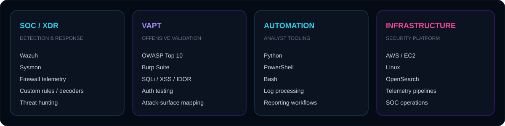
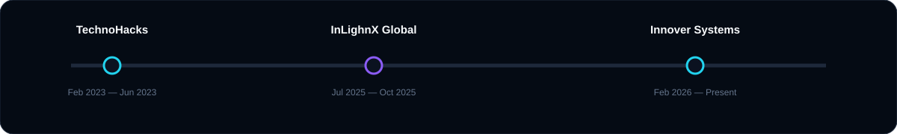
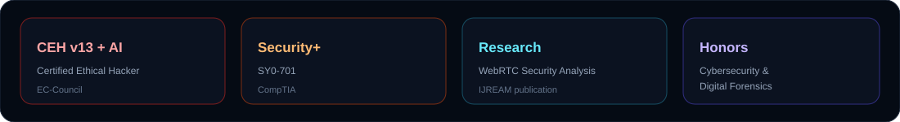

<div align="center">


<br>

<a href="https://linkedin.com/in/ashishpatil7507"></a>
<a href="mailto:ashishpatil.cyber@gmail.com"></a>
<a href="https://github.com/ashishpatil7507"></a>
<a href="https://ashish-patil.gamer.gd"></a>

<br><br>


<br>


</div>

---

<div align="center">

</div>

## Security Profile

> **Cybersecurity Analyst focused on turning security telemetry into actionable detection and turning offensive findings into stronger defensive controls.**

My work sits at the intersection of **SOC operations, SIEM/XDR engineering, threat hunting, detection development and web application security**. I build practical security workflows rather than treating tools as isolated products.

<div align="center">

</div>

---

## Capability Matrix

<div align="center">

</div>

---

## Selected Work

<table width="100%" cellspacing="12">
<tr>
<td width="50%" valign="top">

### 🛡 Wazuh SOC Engineering

`WAZUH` `SIEM/XDR` `SYSMON`

**Detection & visibility**
- Custom decoders and detection rules
- Endpoint and Sysmon telemetry
- Sophos firewall / syslog monitoring
- Security dashboards and alert tuning
- Threat-hunting and investigation workflows

</td>
<td width="50%" valign="top">

### ⚔ Web Application Security

`VAPT` `OWASP` `BURP SUITE`

**Offensive validation**
- OWASP Top 10 assessment
- SQL injection, XSS and IDOR testing
- Authentication / authorization testing
- Attack-surface discovery
- Vulnerability validation and reporting

</td>
</tr>

<tr>
<td width="50%" valign="top">

### ⚙ Security Automation

`PYTHON` `POWERSHELL` `BASH`

**Operational tooling**
- Security-focused scripting
- Log processing and transformation
- Reporting automation
- Repetitive SOC task automation
- Lightweight analyst tooling

</td>
<td width="50%" valign="top">

### ☁ Security Infrastructure

`AWS` `EC2` `LINUX`

**Platform operations**
- SOC infrastructure deployment
- Security telemetry pipelines
- Linux-based monitoring services
- SIEM data ingestion and operations
- Infrastructure troubleshooting

</td>
</tr>
</table>

---

<div align="center">

</div>

## Experience

<div align="center">

</div>

### Cybersecurity Analyst / Purple Team — Innover Systems Pvt. Ltd.
`Feb 2026 – Present`

`SOC` `WAZUH` `SIEM/XDR` `VAPT` `DETECTION ENGINEERING`

Building practical SOC capabilities around endpoint and network telemetry, custom Wazuh detection logic, dashboards, firewall monitoring, threat investigation and vulnerability assessment.

### Offensive Security Intern — InLighnX Global Pvt. Ltd.
`Jul 2025 – Oct 2025`

`WEB SECURITY` `VAPT` `PYTHON`

Performed web application security testing, vulnerability validation and Python-based security automation.

### Ethical Hacking Intern — TechnoHacks EduTech
`Feb 2023 – Jun 2023`

`RECON` `NETWORK SECURITY` `WEB SECURITY`

Worked on network reconnaissance, scanning and practical web-security testing.

---

## Security Arsenal

<div align="center">


<br><br>


<br>


</div>

---

## Credentials & Research

<div align="center">

</div>

- **Certified Ethical Hacker (CEH) v13 with AI**
- **CompTIA Security+ — SY0-701**
- **Cybersecurity & Digital Forensics Honors**
- **IJREAM published research — WebRTC Security Analysis**

---

## GitHub Telemetry

<div align="center">

<a href="https://github.com/ashishpatil7507">

</a>

<a href="https://github.com/ashishpatil7507">

</a>

<br><br>


</div>

---

<div align="center">

</div>

## Security Operating Model

<div align="center">

```text
ATTACK SURFACE
      ↓
VISIBILITY
      ↓
DETECTION
      ↓
INVESTIGATION
      ↓
RESPONSE
      ↓
HARDENING
      ↺
```

**OFFENSE → TELEMETRY → DETECTION → RESPONSE → IMPROVEMENT**

</div>

---

## Contact

<div align="center">

**Open to security engineering, SOC, detection engineering, VAPT and offensive-security opportunities.**

<br>

<a href="https://linkedin.com/in/ashishpatil7507"></a>
<a href="mailto:ashishpatil.cyber@gmail.com"></a>
<a href="https://ashish-patil.gamer.gd"></a>

<br><br>


</div>
