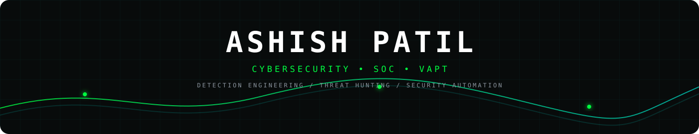

 

  

&nbsp;

&nbsp;

&nbsp;

  

---

## About

Cybersecurity Analyst focused on **SOC operations, vulnerability assessment, web application security, threat hunting, and detection engineering**.

Currently working with **Wazuh, Sysmon, security telemetry, custom detections, firewall logs, and security automation**, while continuing to build practical offensive-security skills.

> **Offense for understanding. Detection for visibility. Engineering for resilience.**

---

## Core Focus

| 🛡️ SOC & Detection | ⚔️ VAPT & AppSec | ⚙️ Security Engineering |
|:---:|:---:|:---:|
| Wazuh SIEM/XDR | OWASP Top 10 | Python |
| Sysmon & Telemetry | Burp Suite | PowerShell |
| Threat Hunting | Nmap / SQLMap | Bash |
| Detection Rules | Web Security | AWS / Linux |

---

## Security Stack

  

---

## Selected Work

### 🛡️ SOC & Detection Engineering
- Wazuh SIEM/XDR deployment and operational monitoring
- Custom decoders, rules, alert tuning, and dashboards
- Sysmon-based endpoint telemetry and threat hunting
- Firewall/syslog ingestion and security-event analysis

### ⚔️ Vulnerability Assessment & Web Security
- OWASP Top 10 assessment methodology
- Web application testing with Burp Suite
- Reconnaissance, validation, and vulnerability reporting
- Practical testing across authentication and application logic

### ⚙️ Security Automation
- Python security scripting
- PowerShell and Bash automation
- Log processing and operational reporting
- Security workflow improvement

---

## Experience

**Cybersecurity Analyst / Purple Team — Innover Systems Pvt. Ltd.**  
`Feb 2026 – Present`

SOC operations • Wazuh • SIEM/XDR • VAPT • Detection Engineering • Threat Hunting

**Offensive Security Intern — InLighnX Global Pvt. Ltd.**  
`Jul 2025 – Oct 2025`

Web application security • Python automation • Vulnerability assessment

**Ethical Hacking Intern — TechnoHacks EduTech**  
`Feb 2023 – Jun 2023`

Network reconnaissance • Web security • Practical security testing

---

## Certifications & Research

`CEH v13 with AI` &nbsp;•&nbsp; `CompTIA Security+`

`Cybersecurity & Digital Forensics Honors`

`IJREAM — WebRTC Security Analysis`

---

## GitHub

  

---

Building security visibility, finding weaknesses, and engineering better defenses.

